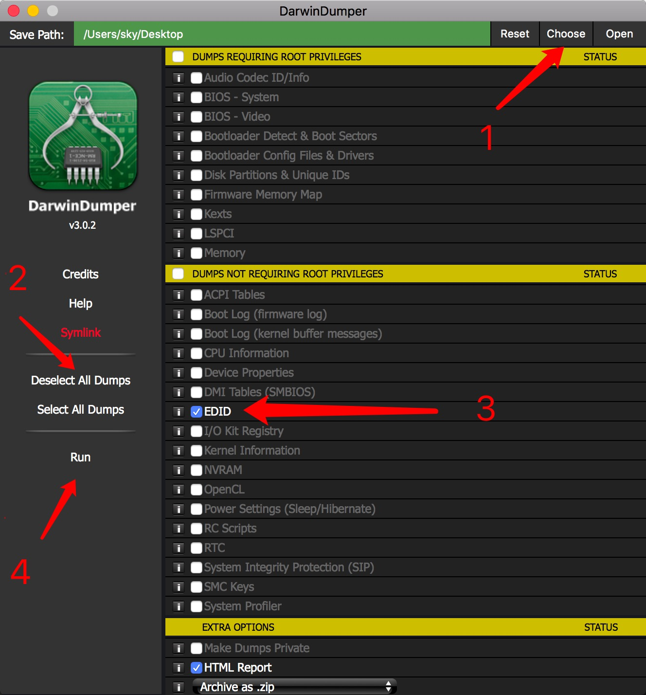
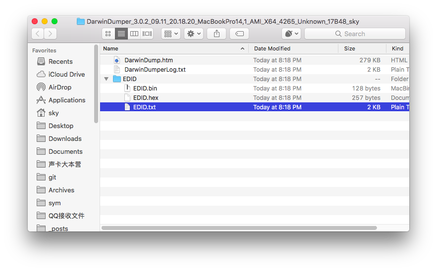

## Anti Screen Flicker Fix by injecting EDID
This fix should remove random flickers whenever the GPU is in use. 

### Step 1: Darwindumper

Open the App DarwinDumper, select the save location, click on deselect all dumps, select EDID and run it to generate the EDID.BIN



### Step 2: FixEDIDv2

Open the App FixEDID, open the BIN File created in step 1, make sure to select the correct aspect ratio. See image. Click on make. This will not give any feedback - just create the files on your desktop in a folder like `DisplayVendorID-143e`. 

### Step 3: Extract EDID
Open the file created in step 2 with any text editor. You need the data from the key IODisplayEDID as well as Products and Vendorid.  
Example:  
```
<key>DisplayProductID</key>
	<integer>45061</integer>
	<key>DisplayVendorID</key>
	<integer>1552</integer>
<key>IODisplayEDID</key>
	<data>
	AP///////wAGEBKgAAAAABwWAQS1MBt4Im+xp1VMniUMUFQAAAABAQEBAQEBAQEBAQEB
	AQEBTdAAoPBwPoAwIDUAWsIQAAAYAAAA/ABpTWFjCiAgICAgICAgAAAA/QA4TB5TEQAK
	ICAgICAgAAAAAAACQQMoABIAAAsBCiAgALs=
	</data>
```

### Step 4: Add to Clover

Open CloverConfig (not supplied in this tutorial) and load your clover config.plist. Paste the DisplayEDID from step 3 to Graphics->EDID and copy the product and vendorid. Select `Inject EDID`. Make sure to remove all newlines or blanks from the string.

### Credits
Reported by: yaozaiyu  
Tools by:  
* Andy Vandijick - https://www.insanelymac.com/forum/topic/290130-fixedid-v232-application-to-generate-overrides-automatically-for-apple-displays/
* BlackOSX - https://bitbucket.org/blackosx/darwindumper/