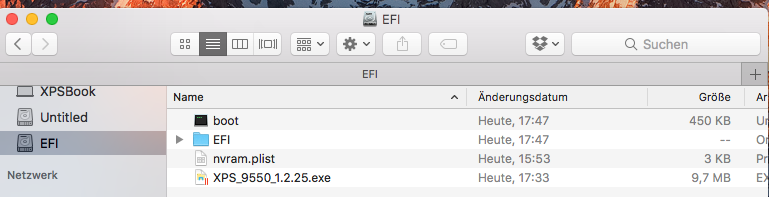
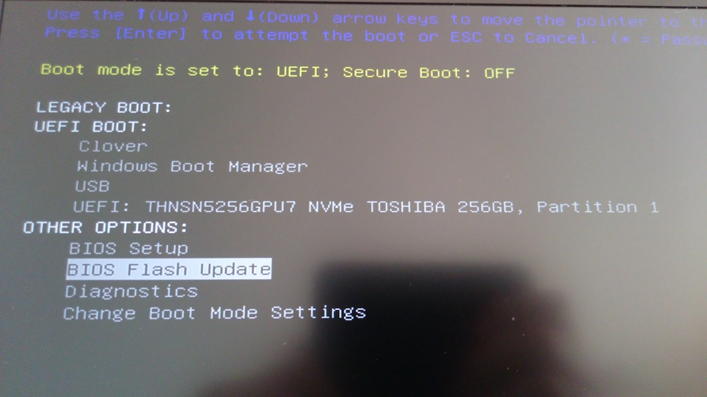
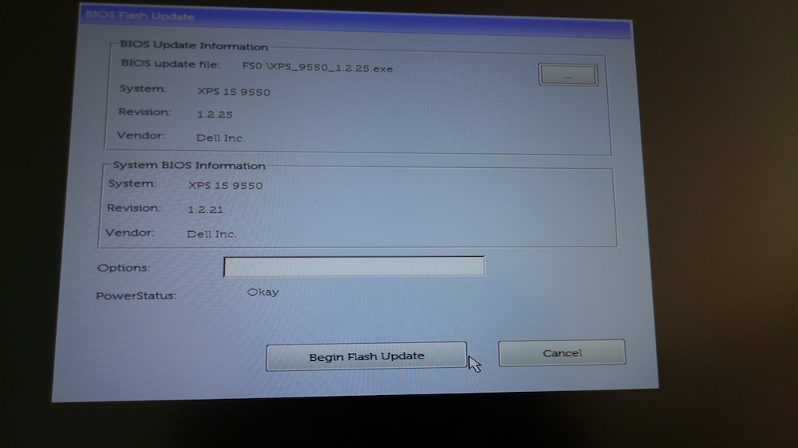
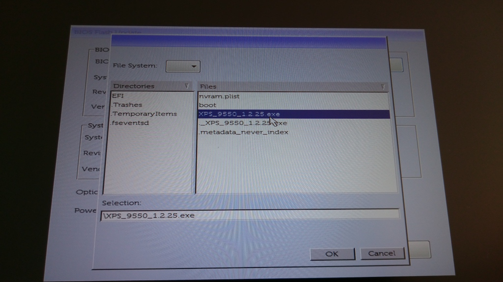
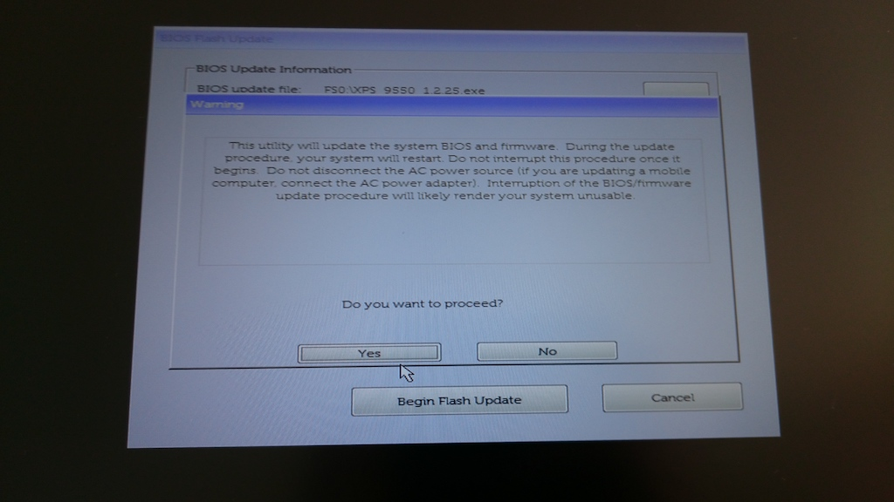
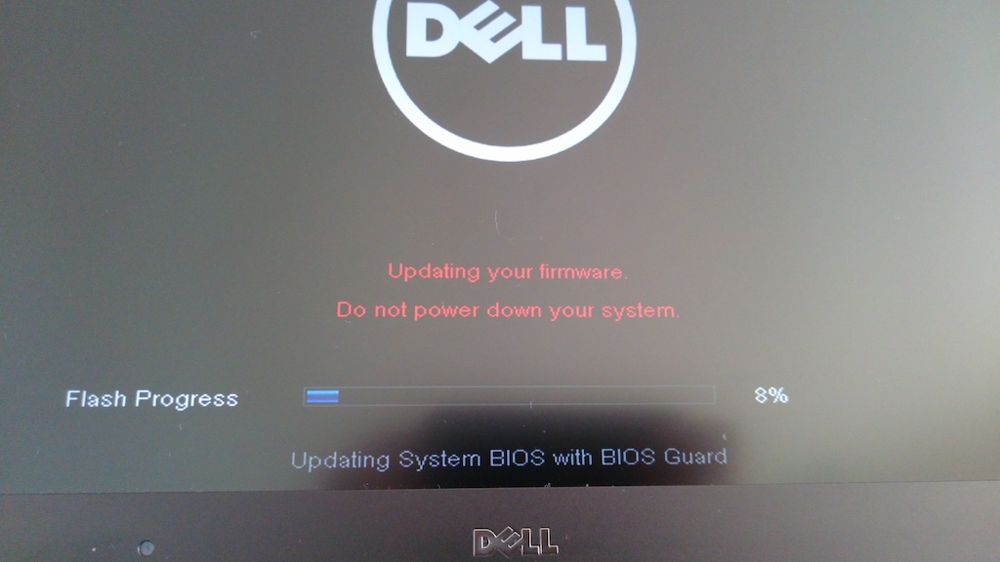
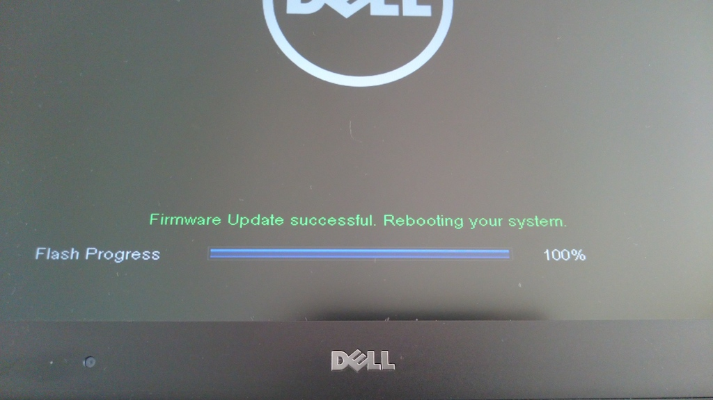

# How to upgrade the Firmware (BIOS) of the Dell XPS 15 9550 and 9560
Step by step tutorial

## Step 1: Place Firmware File

Place the EXE file in the root path of your hidden EFI partition (`diskutil mount EFI` in console)

## Step 2: Goto Boot Menu

Press F12 while visible DELL Logo on reboot

## Step 3: Select File
  

## Step 4: start upgrade

make sure your computer has enough battery power and is connected to the power supply, otherwise flash will not start

## Step 5: wait till automatic reboot
  

# In case something went wrong:
## Create USB Recovery Stick
Format as FAT32, place EXE file on this stick named BIOS_IMG.rcv  

## Goto Recovery Boot
ensure that the laptop's battery is charged up to at least 10%. Verify that the laptop is powered OFF and disconnect the AC adapter.  
  
Insert USB Stick,pPress and hold the CTRL key + ESC key on the keyboard, then plug in the AC adapter to the laptop.  
  
Release the CTRL key + ESC key on the keyboard once you see the BIOS recovery screen.  
On the BIOS Recovery screen, select Reset NVRAM(if available) and press the Enter key. Select Disabled and press the Enter key if you wish to save the current BIOS settings.  
  
Select Recover BIOS and press the Enter key to start the recovery process.  