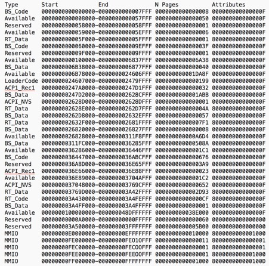
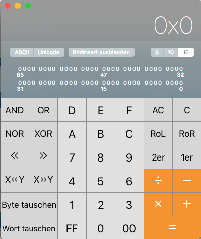

# How to calculate the slide parameter for OsxAptioFix2Drv
If you cannot boot because of an error like "couldn't allocate runtime area, error allocating `0xXXXX` pages (...)" with OSXAptioFIX2 then your memory is too fragmented. 
You need to manually "slide" the pointer of the OSXAptioFix2 to a free continuous map of at least the size of `0xXXXX` in your memory.  
Because this memory map is unique to each system configuration you have to use a different slide command on most computers.    

## Step 1: Get Memory Map  
Boot into the UEFI Shell from Clover and enter the command `memmap`. You'll get an output similar to this


## Step 2: Use hexadecimal calculator
use a **hexadecimal calculator**.   
You can use the Mac OSX Calculator in `Programmers Mode`. You can switch this by the option View->Programmer. Switch the calculator to hex mode by pressing the button labelled **16** (see the buttons 8|10|16)
  

## Step 3: Add the number of pages till first suitable block
Look at the column #Pages (`N Pages`) for a bigger hexadecimal number than the one in your error message. The column `Type` has to be set to `Available`. Then apply the following formula for your calculation:  
### OLD CALCULATION (older CLOVER)
`(START - 100000) / 200000`  
Each integer in slide will move the pointer 200000. It begins at 100000.  
### NEW CALCULATION
`(START / 200000) + 1`
  
   
Look in your memmap for the first `Available` block with enough pages. The slide parameter doesn't work with high numbers, so you should look for the one with the smallest `Start` value.  
  
Example with memmap from Step 1 and the old calculation:
```
Error: Error allocation 19322 pages  
Optimal START = 0x6B78000 with 0x1DA8F pages available  

(6B78000 - 100000) / 200000 = 35. This is NOT your slide parameter!
```

## Step 4: Switch to Base 10 
convert the number to Base10. You can do this with the mac os calc by pressing the button with the 10 on it.  
Example: `0x35 => 53`  

This is your slide parameter. Enter it in your boot command (for example slide=123) and the system should boot up like normal. If it doesn't then maybe your block doesn't have enough free pages and you have to select a bigger one. It's also possible your memory is too fragmented to slide at all or the kernel requests more pages, which are not slideable. In such a case you can use the (unstable) ./10.12/CLOVER/drivers64UEFI/Other/OsxAptioFix2Drv-free2000.efi. More info: see [Step 7 of the tutorial](https://github.com/wmchris/DellXPS15-9550-OSX/blob/master/Tutorial_10.12_Step7.md)
