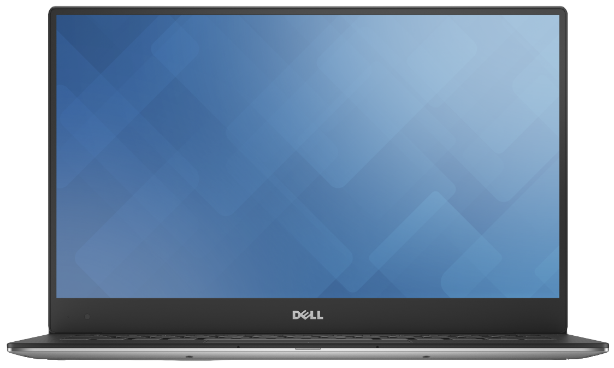

Before we start:
this installation includes real time DSDT/SSDT patching from within clover. This is pretty easy to install. But it is NOT suited for people with no or only few knowledge in Hackintosh Systems. If you only know how to copy commands in your shell and you dont know what they're doing, then stop the tutorial and revert to windows or buy a real mac. Even if you get it running: this system is not failsafe and will be broken multiple times in its usage time, where you have to fix it without a step by step tutorial.
English is not my mother-tongue and i'm writing this without proof reading, so please forgive my bad spelling 

If you've questions: please read the whole document before reporting an issue to prevent multiple questions. Also check [Step7](Tutorial_10.13_Step7.md) and do a google search.  

## Credits:
Based on the files of @Rehabman: https://github.com/RehabMan/OS-X-Clover-Laptop-Config 
Mixed with much knowledge of the tutorial by @Gymnae: http://www.insanelymac.com/forum/topic/319766-dell-xps-9550-detailled-1011-guide/  
and much more. I try to give credit whenever possible in the corresponding readme.md files.  
## What's not working:
* Hibernation  
* SD-Card reader  
* Killer 1535 Wifi (rarely used in the 9550, need replace)  
* nVidia Graphics card (Intel works)  
* FileVault2  
* TB3 over USB-C
## Requirements:
* one working MAC OS X Enviroment  
* 16GB USB Stick (larger is sometimes not bootable and/or requires advanced partitioning)  
* MacOS Sierra 10.13.2 installation file from the app store (redownload, just in case)  
* Knowledge in PLIST editing  
* USB Harddrive for backup - you'll loose all data on your computer! 

## Locations and required Files 
* [this repository](https://github.com/wmchris/DellXPS15-9550-OSX/archive/10.13.zip). Unzip this file to a folder of your choice. I'll refer to this folder by "./" in the whole tutorial.  
* EFI Partition with its folder EFI. This is a hidden partition on your HDD. After mounting it's normally available at /Volumes/EFI/EFI/. I refer to it by EFI/ in the whole tutorial.  

## Step 1: Prepare Installation
If your Firmware is below 1.2.25, upgrade your EFI by using the Firmware Update XPS_9550_1.2.25.exe (Additional/BIOS). Click [here for a Step by Step Tutorial](Additional/bios_upgrade.md)  
Optional: check if your SSD can be switched to 4k sector size. This prevents NVMe corruption. See [this Tutorial](4k_sector.md)  
Use the existing Mac to download the Sierra installer from the App Store and create a bootable USB stick with CLOVER. You can do this with the App "Pandora's Box" of insanelymac (use google for download link), which is pretty easy to use.  
  
Mount the hidden EFI partition of the USB Stick by entering
`diskutil mount EFI` 
Inside the terminal. Mac OS will automatically mount the EFI partition of the USB stick and not the local machine, but just in case: make sure it really is to prevent damage to the host machine  
  
Overwrite everything in the CLOVER folder of the partition EFI with the content of ./10.13/CLOVER.  
If your PC has a Core i5 processor, you'll have to modify your config.plist in EFI/CLOVER/: search for the Key ig-platform-id: 0x191b0000 and replace it with 0x19160000.  
If your PC is equipped with a HYNIX/Plextor/LiteOn SSD - you have to add the following patch to the config.plist:  
```
<dict>
				<key>Comment</key>
				<string>IONVMeFamily Preferred Block Size 0x10 -&gt; 0x02, credit RehabMan based on 10.12 patch, (c) Pike R. Alpha </string>
				<key>MatchOS</key>
				<string>10.13.x</string>
				<key>Name</key>
				<string>com.apple.iokit.IONVMeFamily</string>
				<key>Find</key>
				<data>9sEQD4VBAQAA</data>
				<key>Replace</key>
				<data>9sECD4VBAQAA</data>
</dict>
```  
  
Go into the EFI Configuration (BIOS) of your Dell XPS 15:   
```
gymnae said: 
In order to boot the Clover from the USB, you should visit your BIOS settings:  
- "VT-d" (virtualization for directed i/o) should be disabled if possible (the config.plist includes dart=0 in case you can't do this)  
- "DEP" (data execution prevention) should be enabled for OS X  
- "secure boot " should be disabled  
- "legacy boot" optional  
- "CSM" (compatibility support module) enabled or disabled (varies)  
- "boot from USB" or "boot from external" enabled`  
  
Note: If you get a "garbled" screen when booting the installer in UEFI mode, enable legacy boot and/or CSM in BIOS (but still boot UEFI). Enabling legacy boot/CSM generally tends to clear that problem.  
In my case I left VT-d and Fastboot as they were. Also, update your 9550 to the latest BIOS.  
Don't forget to set mode to "AHCI" in the sub-menu "SATA Operation" of "System Configuration". It's mandatory.
```

Also disable the SD-Card Reader to reduce the power consumption drastically. Insert the stick on the Dell XPS 15 and boot it up holding the F12 key to get in the boot-menu and start by selecting your USB-Stick (if you've done it correctly it's named "Clover: Install macOS Sierra", otherwise it's just the brandname of your USB-Drive). You should get to the MacOS Installation like on a real mac. If you're asked to log-in with your apple-id: select not now! Reason: see Step 5.
## Step 2: Partition and Installation
INFORMATION: after this step your computer will loose ALL data! So if you haven't created a backup, yet: QUIT NOW!  
  
Dont install macOS yet. Select the Diskutil and delete the old partitions. Create a new HFS partition and name it "OSX". If you want to multiboot with Windows 10, then you'll have to create a second partition, too (also HFS! Dont use FAT or it will not boot! You have to reformat it when installing Windows). Make sure to select GUID as partition sheme.
Close the Diskutil and install OSX normally. You'll have to reboot multiple times, make sure to always boot using the attached USB stick. So dont forget to press F12. After the first reboot you should see a new boot option inside clover, which is highlighted by default. Just press enter. If you only see one, then something went wrong.  

## Step 3: Make it bootable
After a few reboots you should be inside your new macOS enviroment. You can always boot into it using the USB stick. Remove the USB drive after successful bootup. Enter 
`diskutil mount EFI`
in your terminal, which should mount the EFI partition of your local installation.  
install ./Additional/Clover_v2.4k_r4061. Make sure to select "Install Clover in ESP". Also select to install the RC-Scripts. This should install the Clover Boot System. Now copy everything from ./10.13/CLOVER to EFI/CLOVER like you did before by creating the usb stick. (if you had to modify the config.plist in step 1, do it here, too). Your system should be bootable by itself. Reboot and check if your system can boot by itself.  

## Step 4: Post Installation
Because all DSDT/SSDT changes are already in the config.plist, you dont need to recompile your DSDT (albeit i suggest doing it anyway to make your system a lil bit more failsafe, see gymnaes El-Capitan tutorial for more informations). So we can skip this part and go directly to the installation of the required kexts. Open a terminal and goto the GIT folder.
```
sudo cp -r ./10.13/Post-Install/LE-Kexts/* /Library/Extensions/  
sudo mv /System/Library/Extensions/AppleACPIPS2Nub.kext /System/Library/Extensions/AppleACPIPS2Nub.bak 2> /dev/null  
sudo mv /System/Library/Extensions/ApplePS2Controller.kext /System/Library/Extensions/ApplePS2Controller.bak 2> /dev/null
sudo ./10.13/Post-Install/AD-Kexts/VoodooPS2Daemon/_install.command
``` 
  
I suggest moving some of the kext from EFI/CLOVER/kexts/10.13 to /Library/Extensions.
  
If your notebook is equipped with the UHD touch monitor, you'll have to copy the UHD enabling kexts to your clover directory:
```
sudo cp -R ./10.13/Post-Install/AD-Kexts/UHD-Kexts/* /Volumes/EFI/EFI/CLOVER/kexts/10.13/
```
To enable GPU acceleration: Edit your clover config file again and remove the following block from it:  
```
<key>FakeID</key>
		<dict>
		   <key>IntelGFX</key>
		   <string>0x12345678</string>
		</dict>
```
   
Finalize the kext-copy by recreating the kernel cache:
```
sudo rm -rf /System/Library/Caches/com.apple.kext.caches/Startup/kernelcache  
sudo rm -rf /System/Library/PrelinkedKernels/prelinkedkernel  
sudo touch /System/Library/Extensions && sudo kextcache -u /
```
sometimes you'll have to redo the last command if your system shows "Lock acquired". 
   
OSX 10.12.2 removed the posibility to load unsigned code. You can enable this by entering 
`sudo spctl --master-disable `  
  
To prevent getting in hibernation (which can and will corrupt your data if you're not using the 4k switch).
`sudo pmset -a hibernatemode 0` or run the script in `./10.13/Post-Install/AD-Kexts/Hibernation/disablehibernate.sh`  
  

## Step 5: iServices (AppStore, iMessages etc.)
WARNING! DONT USE YOUR MAIN APPLE ACCOUNT FOR TESTING! It's pretty common that apple BANS your apple-id from iMessage and other services if you've logged in on not well configured hackintoshs!  
If you want to use the iServices, you'll have to do some advanced steps, which are not completly explained in this tutorial. First you need to switch the faked network device already created by step 4 to be on en0. Goto your network settings and remove every network interface, then `sudo rm /Library/Preferences/SystemConfiguration/NetworkInterfaces.plist` and reboot. Go back in the network configuration and add the network interfaces (LAN) before Wifi.  
You also need to modify your SMBIOS in the config.plist of Clover in your EFI partition with valid informations about your "fake" mac. There exist [multiple tutorials](http://www.fitzweekly.com/2016/02/hackintosh-imessage-tutorial.html) which explain how to do it.   
It's possible you have to call the apple hotline to get your fake serial whitelisted by telling a good story why apple forgot to add your serial number in their system. (aka: dont do it if you dont own a real mac). I personally suggest using real data from an old (broken) macbook.
## Step 6: Upgrading to macOS 10.13.2 or higher / installing security updates
Each upgrade will possibly break your system!  
(Update: after the latest updates in the tutorial the system should be relative update-proof)  

## Step 7: Fixes / Enhancements / Alternative Solutions / Bugs
If you have any problems, please read this section first. It contains some fixes to known problems and ideas.  
I moved this part to its own file. Please click [here](Tutorial_10.13_Step7.md)  

## Afterword
as i said before: this is not a tutorial for absolute beginners, albeit it's much easier then most other tutorials, because most is preconfigured in the supplied config.plist. Some Dells have components included, which are not supported by these preconfigured files. Then i can only suggest using Gymnaes tutorial which explains most of the DSDT patching, config.plist editing and kexts used in detail and use the supplied files here as templates.  
*	Warning: Some people have reported multiple data losses on this machine. I suggest using time-machine whenever possible!  
*	4K Touchscreen only: Multitouch can be achieved with the driver from touch-base.com, but it's not open source - costs > 100 $   
*	Not a bug: if you REALLY want to use the 4K Display natively and disable the Retina Mode (max 1920x1080), google it or see [this tutorial](http://www.everymac.com/systems/apple/macbook_pro/macbook-pro-retina-display-faq/macbook-pro-retina-display-hack-to-run-native-resolution.html)
   

## Tutorial Updates
* on 4. Nov 2017: Update to OSX 10.13.1
* on 13. May 2017: APTIOv2 for Dell Firmware 1.2.25 and up
* on 4. April 2017: Updated Tutorial and added Step 7
* on 27. March 2017: UHD Kexts added, replaces perl command  
* on 23. March 2017: 4k sector tutorial against NVMe corruption added  
* on 7. March 2017: Suggestion to disable the SD Card Reader for reduced power consumption  
* on 4. February 2017: Dell SMBIOS Truncation workaround added  
* on 23. January 2017: Hynix SSD fix added  
* on 15. January 2017: updated tutorial regarding power management  
* on 31. December 2016: USB-C Hotplug Fix and USB InjectAll Removed  
* on 28. December 2016: NVMe SSDT Spoof precreated, FakeID already preset in installation config.plist. VoodooHDA added as alternative to SSDT-ALC298 patch as well as color coding in tutorial  
* on 22. December 2016: FakeSMBios added  
## Appendix 1: Accessories
The official [Dell adaptor DA200](http://accessories.euro.dell.com/sna/productdetail.aspx?c=at&l=de&s=dhs&cs=atdhs1&sku=470-abry) works completly on Sierra 10.13.2. You can use the Network, USB, HDMI and VGA. Everything is full hot-pluggable  
a cheap 3rd party noname USB-C -> VGA adaptor didnt work  
you can charge the Dell with a generic USB-C Power Adaptor, but USB-C has only a maximum power of 100W, so it's either charging OR usage, not both. Dont forget you need a special USB-C cable (Power Delivery 3.0) for charging  
